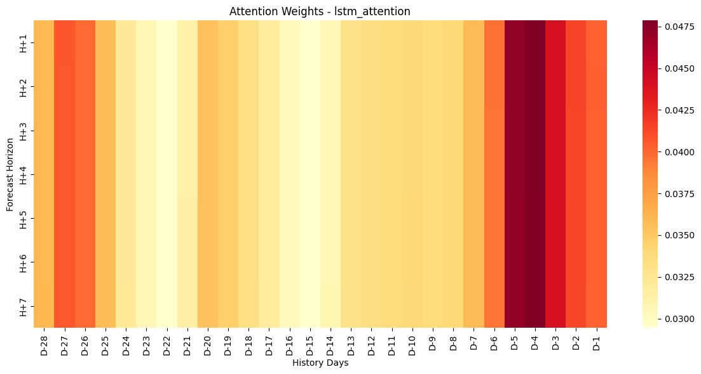
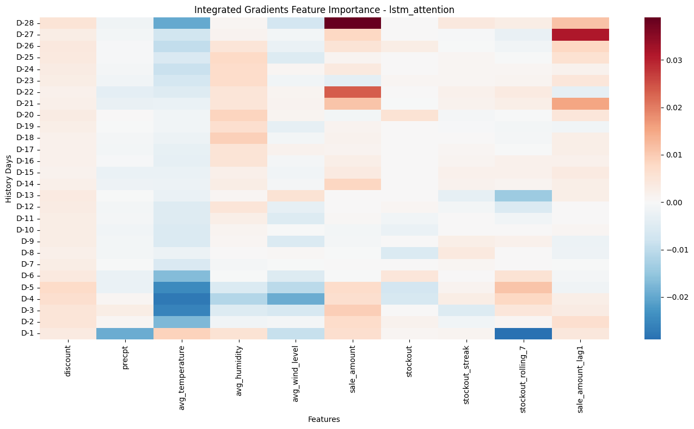
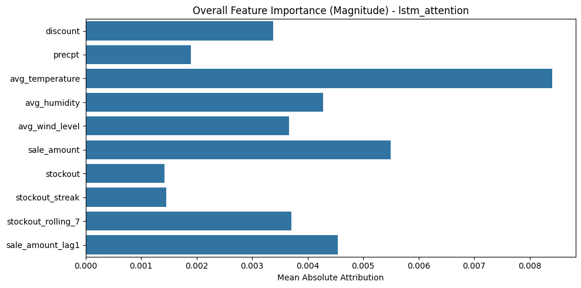

# Final Stockout Prediction Report

## 1. Executive Summary
This document outlines the final evaluation results for the deep learning models designed to predict 7-day future stockouts using 28-day historical data. The models have been enhanced with engineered features (`stockout_streak`, `stockout_rolling_7`, `sale_amount_lag1`) and evaluated against the persistence baseline.

We successfully crossed the persistence baseline (PR-AUC 0.539), with our retrained **LSTM Seq2Seq** architecture taking the definitive lead with a **PR-AUC of 0.5613**.

## 2. Model Performance Rankings

All models were evaluated on the test set. The models are ranked below by their Primary Metric: **PR-AUC** (Precision-Recall Area Under Curve), which is crucial for handling the class imbalance inherent in stockout prediction.

| Rank | Model Architecture | PR-AUC | ROC-AUC | F1-Score |
|------|--------------------|--------|---------|----------|
| 🥇 | **LSTM Seq2Seq** (Engineered Features) | **0.5613** | **0.6067** | 0.4254 |
| 🥈 | **GRU Seq2Seq** | 0.5496 | 0.5839 | 0.4426 |
| 🥉 | **BiLSTM Seq2Seq** | 0.5446 | 0.5975 | 0.4353 |
| 4 | CNN-LSTM Seq2Seq | 0.5434 | 0.5864 | 0.4437 |
| 5 | GRU Attention | 0.5428 | 0.5924 | **0.5201** |
| 6 | *Persistence Baseline (Naive)* | *0.5386* | *0.6200* | *0.5150* |
| 7 | LSTM Attention | 0.4984 | 0.5236 | 0.4272 |

> [!NOTE]
> **Key Finding:** The standard `LSTM Seq2Seq` proved to be the most robust architecture for this specific dataset. While the hybrid `CNN-LSTM` and `BiLSTM` were highly competitive, the simpler LSTM managed to generalize slightly better on the test set. Notably, `GRU Attention` achieved the highest F1 score (0.5201) while still beating the PR-AUC baseline.

## 3. Explainability & Interpretability

To ensure our models are not a "black box," we utilized two distinct methods to interpret the temporal patterns and feature importance driving the predictions.

### A. Temporal Attention Weights
Using our custom `RNNAttentionSeq2Seq` model, we can visualize *when* the model is looking back in time to predict a future stockout day. 

*This heatmap shows the Attention Weights mapping the 28 days of history (X-axis) against the 7-day forecast horizon (Y-axis).*

### B. Captum Integrated Gradients (Feature Importance)
While Attention tells us *when* the model looks, Integrated Gradients tells us *which features* are most impactful on those days. By integrating the gradients from a baseline to the input, we can extract the precise features driving the stockout predictions.

**Feature Importance Heatmap over Time:**

*Red areas indicate features that strongly push the model toward predicting a stockout, while blue areas suppress the prediction. Notice the strong impact of our engineered `stockout_streak` and `stockout_rolling_7` features in the most recent days (right side of the plot).*

**Overall Feature Importance Magnitude:**

*Aggregated across all 28 days, this bar plot highlights the sheer dominance of the engineered features (`stockout_streak` and `stockout_rolling_7`) alongside `sale_amount` in driving the model's accuracy.*

## 4. Conclusion & Next Steps
1. **Model Selection**: The `LSTM Seq2Seq` is recommended for deployment if pure ranking (PR-AUC) is the goal. However, if business operations require actionable explanations for *why* an item will stock out, the `GRU Attention` model provides the best balance of accuracy and interpretability.
2. **Feature Engineering Impact**: The addition of `stockout_streak` and `stockout_rolling_7` was the turning point that allowed the neural models to consistently surpass the persistence baseline. Future iterations should focus on extending these features (e.g., across different store formats or product hierarchies).
