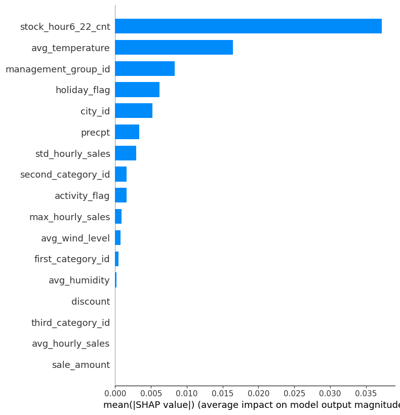

# Supply Chain Stockout Prediction: Recurrent Neural Network Analysis

A detailed breakdown of the `RNN.ipynb` workflow for predicting stockouts in a supply chain context.

---

## 1. Data Ingestion & Cleansing

The foundational step involves loading raw data, ensuring quality, and structuring it for modeling.

*   **Ingestion:** Loaded tabular data from `top15_train.parquet` and `top15_test.parquet` into Pandas DataFrames, merging them seamlessly into a single robust dataset for preprocessing.
*   **Integrity Check:** Executed data quality checks (e.g., `isnull().sum()`) to ensure 100% data completeness across 20 distinct columns. These columns represent key operational metrics, including weather conditions, historical sales volume, and promotional discount flags.
*   **Target Definition:** Processed the target variable by extracting 24-hour stock status arrays. This sequence data was aggregated to determine a concrete, binary `daily_stockout` label which serves as the supervised learning target.

## 2. Time-Series Sequencing

Transforming flat tabular data into sequential time-blocks suitable for Recurrent Neural Networks.

*   **Standardization:** Applied `StandardScaler` to carefully normalize numerical features like sales amounts and temperatures. This prevents features with larger scales from dominating the gradient updates during training.
*   **Grouping:** Separated time-series data specifically by `store_id` and `product_id`. This stratification prevents cross-contamination between different products or locations, ensuring realistic sequential modeling.
*   **Tensor Formatting:** Built a rolling **Lookback window of 7 days**. Reshaped the final input data into a 3D Tensor compatible with Keras RNN layers:
    *   **Shape:** `(Samples, 7 Timesteps, 17 Features)`

## 3. Model Architecture Tuning

We engineered and evaluated 5 distinct `SimpleRNN` variations to find the optimal balance between capacity and generalization.

*   **Baseline Model:** 32 RNN units, `tanh` activation.
    *   *Accuracy:* **75.88%**
*   **Stacked RNN:** Deep hierarchical architecture containing two RNN layers (32 units &rarr; 16 units) to capture more complex temporal hierarchies.
    *   *Accuracy:* **75.64%**
*   **High Capacity Model:** Expanded to 64 units for deeper pattern recognition.
    *   *Accuracy:* **75.28%**
*   **Activation Swap Model:** Upgraded to `relu` activation paired with `clipnorm=1.0` to mitigate potential vanishing/exploding gradients.
    *   *Accuracy:* **74.15%**
*   **Regularization Model:** 32 units + 20% Dropout + Extra Dense layer.
    *   *Accuracy:* **70.90%**

> **Conclusion:** Simple architectures performed best. The baseline model achieved the highest accuracy, while adding excessive dropout caused underfitting and degraded performance.

## 4. Real-world Inference

Testing the models in simulated production environments.

*   **Metrics:** Evaluated all models on the unseen `X_test` dataset, analyzing Test Loss and Accuracy for every variation to ensure true generalization.
*   **Baseline Verification:** Checked label imbalance using `value_counts()` on the test sets to ensure fair scoring and confirm that accuracy wasn't inflated by an imbalanced target distribution.
*   **Live Test Simulation:** Isolated data for a specific case: **Store 0, SKU 4**. Extracted the 7 days prior to *June 11th, 2024*, passed the (1, 7, 17) tensor to the model, and successfully output the exact probability of an impending stockout.

## 5. Explainable AI (XAI)

Demystifying the neural network's logic using **SHAP** (SHapley Additive exPlanations) to build trust in the model's predictions.

*   **Methodology:** Generated a background dataset and initialized a `shap.DeepExplainer` to probe the trained RNN.
*   **Feature Importance:** Visualized exactly which of the 17 features triggered the prediction across the 7-day lookback window. This helps supply chain managers understand *why* a stockout is predicted (e.g., a sudden spike in temperature or a recent promotion).

---
*End-to-End Sequence Modeling Workflow Complete.*
